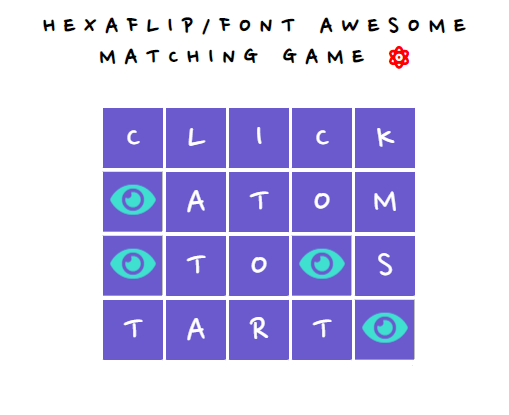

Built using HTML, CSS, JAVASCRIPT, [HEXAFLIP](https://github.com/dmotz/hexaflip) plugin and [FONT AWESOME](https://fontawesome.com/) Icons

A simple match the pairs game, based around Hexaflip.

The pairs are Icons from Font Awesome.

Instead of flipping flat cards, you spin Hexaflip Hexes.

Hexaflip code modified in two ways.

1. Hexaflip.js has small bit of extra code added so it accepts FA icons inside HTML *<a*> elements. 
  
1. Click and dragging on hexes is disabled. Otherwise you'd be able to see the hiddden icons and it wouldn't be much of a game. Click and drag disabled by adding "pointer-events: none" to ".hexaflip-cube" class in CSS
